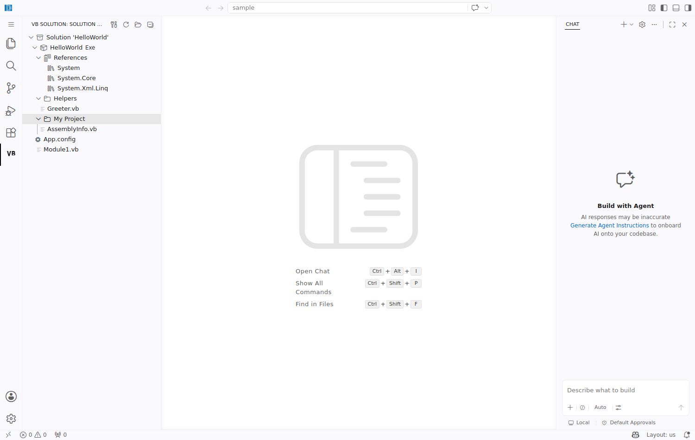
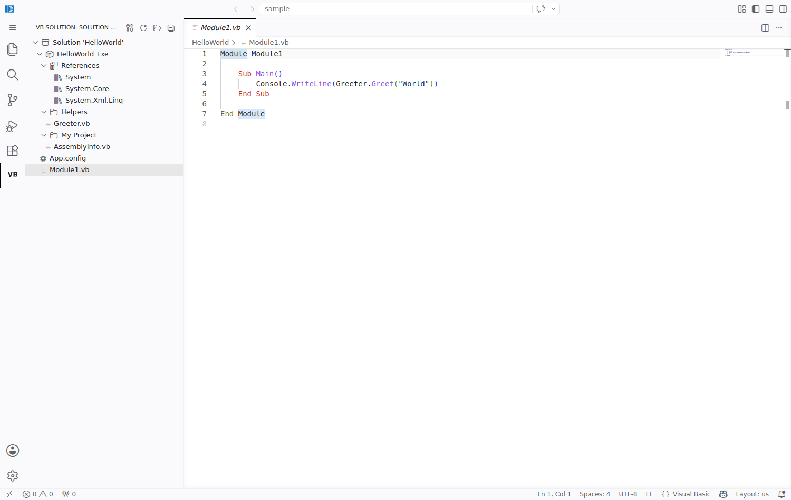
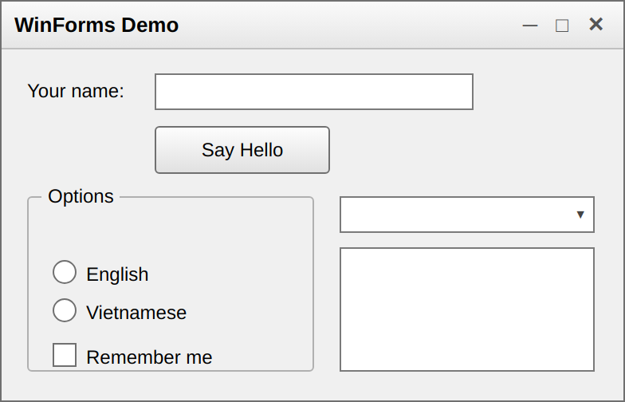

# VB.NET Solution Explorer

A Visual Studio Code extension that lets you **open, browse, build, run and debug
VB.NET (.NET Framework) solution (`.sln`) files** — without needing the full
Visual Studio IDE.

The `.sln` format itself is language-agnostic (it is identical for C# and
VB.NET); the difference is the project file (`.vbproj` instead of `.csproj`).
While the marketplace already has C#-focused solution explorers, this extension
is written from scratch with VB.NET / .NET Framework projects in mind.

## Screenshots

Solution Explorer tree (Solution → Project → References / Folders / Files):



Click a file to open it in the editor:



Read-only WinForms form preview (right-click a form's `.vb` → **View Form Designer**):



## Features

- **Solution Explorer tree** — parses the `.sln` and each non-SDK `.vbproj` and
  shows a Visual-Studio-like tree (Solution → Projects → References → Folders →
  Files). Dependent files (e.g. `Form1.Designer.vb`, `Form1.resx`) are nested
  under their parent (`Form1.vb`). Click a file to open it.
- **Form preview (read-only)** — renders a WinForms form from its
  `*.Designer.vb` (`InitializeComponent`) in a webview: standard controls
  (Label, TextBox, Button, CheckBox, RadioButton, ComboBox, ListBox, …) and
  nested containers (Panel / GroupBox). Open it by right-clicking the form in the
  tree or via the editor title-bar button. It is an approximation, not the live
  WinForms engine, so it works cross-platform (Windows/macOS/Linux).
- **Build / Rebuild** the whole solution or an individual project with MSBuild.
- **Run** an executable project (`OutputType` = `Exe`/`WinExe`).
- **Debug** a .NET Framework executable using the `clr` debugger provided by the
  official C# extension.

## Requirements

This extension targets **classic .NET Framework** projects, so it expects a
**Windows** environment with:

- **Visual Studio** or **Visual Studio Build Tools** installed (provides
  `MSBuild.exe`, located automatically via `vswhere`).
- The **C# extension** (`ms-dotnettools.csharp`) — **optional**, only needed for
  the **Debug** feature (it provides the `clr` debugger). The extension checks
  for it at debug time and shows a helpful message if it is missing. Browsing the
  solution tree, building and running work without it.

> Note: the C# extension is **not** a hard dependency. The extension activates
> and loads the Solution Explorer even when the C# extension is not installed.

## Installation

### From a `.vsix` package

```bash
# build the package (requires Node.js)
npm install
npm run compile
npx @vscode/vsce package        # produces vb-solution-explorer-<version>.vsix

# install into VS Code
code --install-extension vb-solution-explorer-0.1.0.vsix
```

Or in VS Code: **Extensions** view → `...` menu → **Install from VSIX...** and
pick the `.vsix` file.

### From source (development)

See the [Development](#development) section below — press <kbd>F5</kbd> to run an
Extension Development Host.

## Usage

1. Open a folder that contains a VB.NET `.sln` file. The **VB Solution** view
   appears in the Activity Bar and loads the solution automatically.
2. Use the title-bar buttons or right-click nodes in the tree:
   - Right-click the **Solution** → *Build* / *Rebuild*.
   - Right-click a **Project** → *Build Project* / *Run* / *Debug*.
   - Right-click a **form** (a `.vb` with a `.Designer.vb`) → *View Form Designer*,
     or use the editor title-bar button while a form file is open.
3. To open a different solution, run **VB: Open Solution (.sln)** from the
   command palette or the view title bar.

## Settings

| Setting | Default | Description |
| --- | --- | --- |
| `vbsln.configuration` | `Debug` | MSBuild configuration used for build/run/debug. |
| `vbsln.msbuildPath` | `""` | Explicit path to `MSBuild.exe`. Leave empty to auto-detect with `vswhere`. |

## How it works

| Concern | Implementation |
| --- | --- |
| Parse `.sln` | `src/solution/SolutionParser.ts` — scans `Project(...)` lines, skips solution folders. |
| Parse `.vbproj` | `src/solution/VbprojParser.ts` — reads `OutputType`, `AssemblyName`, `OutputPath`, `RootNamespace`, items (with `DependentUpon`), references and folders. |
| Tree view | `src/tree/SolutionTreeProvider.ts` + `src/tree/nodes.ts`. |
| Form preview | `src/form/DesignerParser.ts` parses `InitializeComponent`; `src/form/formHtml.ts` renders the layout; `src/form/FormPreviewPanel.ts` hosts the webview. |
| Locate MSBuild | `src/build/MSBuildLocator.ts` — runs `vswhere -find MSBuild\**\Bin\MSBuild.exe`. |
| Build | `src/build/BuildService.ts` — runs MSBuild as a VS Code task with the `$msCompile` problem matcher. |
| Run | `src/run/RunService.ts`. |
| Debug | `src/debug/DebugService.ts` — launches a `clr` debug session. |

## Development

```bash
npm install
npm run compile      # or: npm run watch
```

Press <kbd>F5</kbd> to launch an **Extension Development Host**. The included
`sample/` folder contains a VB.NET .NET Framework solution (`HelloWorld.sln`)
with a console project and a **WinForms project** (`WinFormsDemo`) for testing
the tree, dependent-file nesting, the form preview, and the build/run/debug
flows.

## Limitations

- **Build / Run / Debug** are Windows only (classic .NET Framework + MSBuild +
  `clr` debugger). The Solution Explorer tree and **form preview** work on any OS.
- Targets **non-SDK** `.vbproj` files. SDK-style projects are not the primary
  focus (the project parser is isolated to make adding them later easy).
- The **form preview is read-only and approximate**: it renders standard controls
  and Panel/GroupBox nesting from the designer code, but does not run the real
  WinForms engine, custom/third-party controls, anchoring/docking, or complex
  layouts (e.g. TableLayoutPanel). Drag-and-drop editing is not (yet) supported.
- Does not provide VB.NET IntelliSense / language services (out of scope).
